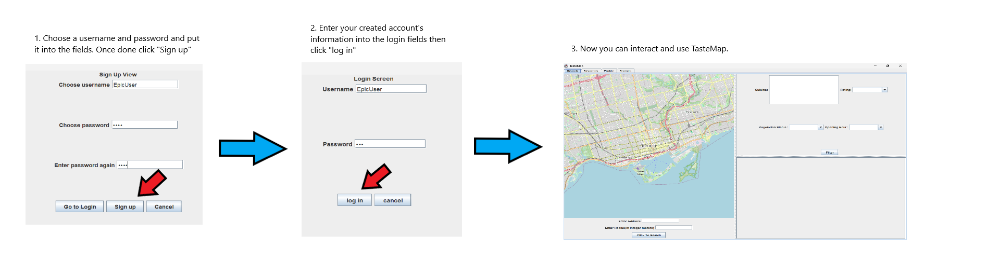
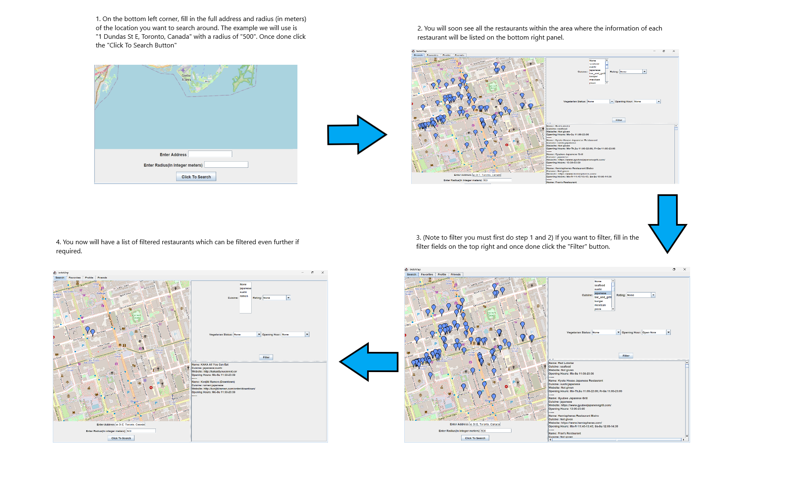

# TasteMap - Restaurant Finder 
CSC207 Final Project

Authored By: Matthew Chen (Yeetmashoe), Golbarg Ghazinour (Golbarg-max), Ankur Phadke (AnkPha), Daniel Tan (DanielTan245)

## Summary 
TasteMap is a socially-driven restaurant discovery and rating platform designed to help users make informed dining choices based on personal preferences, dietary needs, and trusted social connections.
  
### What Does TasteMap Do?
T#asteMap allows users to search for nearby restaurants using an interactive map. Users can filter their results by cuisine, dietary needs such as vegetarian or gluten-free options, and nutritional information powered by external APIs. The platform also enables users to bookmark their favorite restaurants, leave detailed reviews and ratings, and share these with their friends. By connecting with others, users can view friends’ favorite spots, reviews, and shared recommendations to guide their own dining choices.

TasteMap integrates data Edamam nutrition sources, as well as Google Maps Mapping information, to deliver recommendations that are not only personalized but also accessible and health-conscious.
  
### Why Was TasteMap Created?
TasteMap was created to address a gap in existing restaurant discovery tools. Most platforms focus on generic reviews and popularity rankings but often ignore important factors such as dietary restrictions, allergen sensitivity, and the influence of trusted peer recommendations. Our team recognized the need for a more socially-aware and inclusive dining app—one that empowers users to explore restaurants that genuinely fit their preferences and lifestyle. By combining social features with intelligent filtering and real-time location data, TasteMap offers a more meaningful and personalized food discovery experience.

## Table of Contents
1. [Features](#features)
2. [Installation](#installation)
3. [Usage Guide](#usage-guide)
4. [Licensing](#licensing)
5. [Feedback](#feedback)
6. [Contributions](#contributions)

## Features
1. Search Nearby Restaurants:
   * Enter address and radius to locate nearby restaurants using Overpass data.
2. Multi-Criteria Filtering:
   * Filter search results by cuisine, rating, vegetarian status, and current opening status.
3. Live Availability Indicator:
   * Know which restaurants are currently open or closed.
4. Review Restaurants:
   * Leave reviews for restaurants.
5. Favorite Restaurants:
   * Save restaurants as favorites.
6. Connect With Friends:
   * See friends' profiles and restaurant preferences.
How to sign up And log in.

How to search and filter.

## Installation
### Prerequisites
* Java Development Kit (JDK): Version 11 (Corretto-11.0.27 recommended)
* Apache Maven: For building and managing dependencies 
* Git: For cloning the repository

### Required Dependencies
* All dependencies are managed via Maven. Key external libraries include:
* com.google.code.gson:gson:2.8.9 – JSON serialization/deserialization 
* com.squareup.okhttp3:okhttp:4.12.0 – HTTP requests 
* org.json:json:20240303 – JSON utilities 
* org.jxmapviewer:jxmapviewer:2.2.6 – JavaFX-based map rendering 
* junit:junit:4.13.1 and org.junit.jupiter:*:5.8.1 – Testing framework 
* org.opentest4j:opentest4j:1.2.0 – Test diagnostics 
* Kotlin Standard Library (required for Kotlin dependencies used in the project)

**All of the above are automatically installed when you build the project using Maven.** 

## Usage Guide
After successfully launching TasteMap, follow these easy steps below to begin fully using the app:
1. Log in or Sign up 
   * Open the application and create a new account or log in using your existing credentials.
2. Explore the Map
   * Put in your address and use the interactive map to browse restaurants in your current area. Waypoints will display available restaurants that are near you.
3. Apply Filters (If Necessary)
   * Click on the filter panel to narrow your search based on:
     * Cuisine (e.g. Korean, Italian, Japanese)
     * Dietary needs (e.g. Gluten-free, Vegetarian)
     * Allergen information and nutrition data 
4. View Restaurant Details 
   * View key details of all the restaurants in the sidebar, with information on address, hours website, ratings, and reviews
5. Bookmark Favourites
   * Add restaurants to your personal favourites list to easily revisit or share later.
6. Read and Leave Reviews 
   * Browse reviews from your friends and others. In addition to this you can also submit your own rating and review based on your experience at the restaurant.
7. Connect with Friends
   * Search for friends, send friend requests and view their favourite restaurants and reviews to get trustworthy recommendations. 

## License Notice

This repository is licensed under the [Creative Commons Attribution-NonCommercial-NoDerivatives 4.0 International](https://creativecommons.org/licenses/by-nc-nd/4.0/) license.

This means:
- You **may fork and use** the repository **for personal and non-commercial purposes only**.
- You **may not modify or redistribute** any part of the project without the author's explicit permission.
- You must provide **attribution** if you reference or discuss the code.

If you'd like to request special permission (e.g. for academic or showcase use), please contact matthewjyc.chen@mail.utoronto.ca, golbarg.ghazinour@mail.utoronto.ca, ankur.phadke@mail.utoronto.ca, and dan.tan@mail.utoronto.ca.

## Feedback
We welcome feedback to improve TasteMap. Please use the [Google Feedback Form](https://docs.google.com/forms/d/e/1FAIpQLScWictV0tHsR76KfNOf8aDTFHIuKvB67IebVwYVZ2d3Vh0zIw/viewform?usp=header) to share your thoughts, suggestions, or report bugs.
### Guidelines for Feedback
* Be clear and specific in your suggestions
* Include screenshots or screen recordings if helpful
* Use respectful and constructive language
### What to expect
We will review feedback weekly. If your suggestion or issue is prioritized for a future release we will follow up with you (if you leave your contact info).

## Contributions
We welcome contributions to TasteMap!

### How to Contribute?
1. Fork the repository on [Github](https://github.com/AnkPha/csc207-group-16-project)
2. Create your own branch
3. Make your changes 
4. Commit and push to your own repo
5. Submit a pull request (PR) with a clear description of your changes

### Contribution Guidelines
* Make sure your code is clean, commented, and tested
* Only submit PRs when your feature is complete
* Include relevant screenshots or GIFs if your changes impact the UI
* Follow the code style and structure used throughout the project