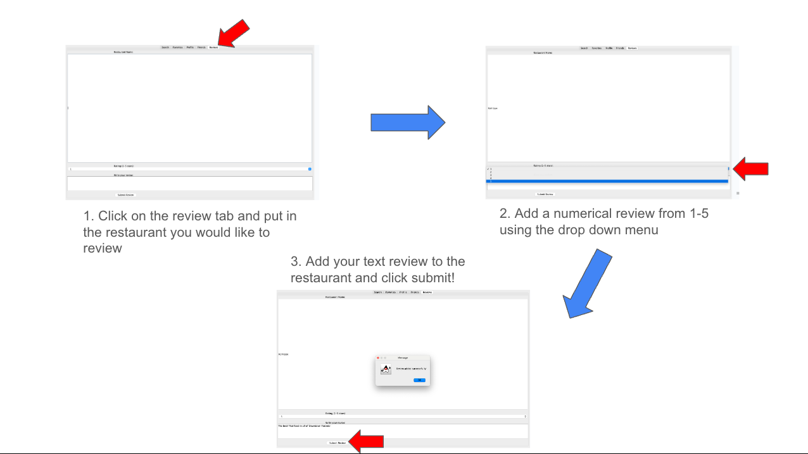

# TasteMap - Restaurant Finder 
CSC207 Final Project

Authored By: Matthew Chen (Yeetmashoe), Golbarg Ghazinour (Golbarg-max), Ankur Phadke (AnkPha), Daniel Tan (DanielTan245)

## Summary 
TasteMap is a socially-driven restaurant discovery and rating platform designed to help users make informed dining choices based on personal preferences, dietary needs, and trusted social connections.
  
### What Does TasteMap Do?
T#asteMap allows users to search for nearby restaurants using an interactive map. Users can filter their results by cuisine, dietary needs such as vegetarian or gluten-free options, and nutritional information powered by external APIs. The platform also enables users to bookmark their favorite restaurants, leave detailed reviews and ratings, and share these with their friends. By connecting with others, users can view friends’ favorite spots, reviews, and shared recommendations to guide their own dining choices.

TasteMap integrates data Edamam nutrition sources, as well as Google Maps Mapping information, to deliver recommendations that are not only personalized but also accessible and health-conscious.
  
### Why Was TasteMap Created?
TasteMap was created to address a gap in existing restaurant discovery tools. Most platforms focus on generic reviews and popularity rankings but often ignore important factors such as dietary restrictions, allergen sensitivity, and the influence of trusted peer recommendations. Our team recognized the need for a more socially-aware and inclusive dining app—one that empowers users to explore restaurants that genuinely fit their preferences and lifestyle. By combining social features with intelligent filtering and real-time location data, TasteMap offers a more meaningful and personalized food discovery experience.

## Table of Contents
1. [Features](#features)
2. [Installation](#installation)
3. [Usage Guide](#usage-guide)
4. [Licensing](#license-notice)
5. [Feedback](#feedback)
6. [Contributions](#contributions)

## Features
1. Log In or Sign Up 
   * Create a new TasteMap account or log in with existing credentials to access personalized features. 
2. Search Nearby Restaurants
   * Find restaurants within a specified radius using Overpass data by entering an address and search distance. 
3. Multi-Criteria Filtering
   * Narrow search results by cuisine, rating, vegetarian status, and whether the restaurant is currently open. 
4. Live Availability Indicator
   * Instantly see which restaurants are open or closed in real time. 
5. Review Restaurants
   * Read reviews from friends and other users, and share your own ratings and feedback based on your dining experience. 
6. Favorite Restaurants
   * Save restaurants to your personal favorites list for quick access or sharing with friends. 
7. Connect with Friends
   * Search for friends, send friend requests, and view their favorite restaurants and reviews to discover trustworthy recommendations.

## Installation
### Prerequisites
* Java Development Kit (JDK): Version 11 (Corretto-11.0.27 recommended)
* Apache Maven: For building and managing dependencies 
* Git: For cloning the repository

### Required Dependencies
* All dependencies are managed via Maven. Key external libraries include:
* com.google.code.gson:gson:2.8.9 – JSON serialization/deserialization 
* com.squareup.okhttp3:okhttp:4.12.0 – HTTP requests 
* org.json:json:20240303 – JSON utilities 
* org.jxmapviewer:jxmapviewer:2.2.6 – JavaFX-based map rendering 
* junit:junit:4.13.1 and org.junit.jupiter:*:5.8.1 – Testing framework 
* org.opentest4j:opentest4j:1.2.0 – Test diagnostics 
* Kotlin Standard Library (required for Kotlin dependencies used in the project)

**All of the above are automatically installed when you build the project using Maven.**

Maven will automatically download these libraries for us. In the Project Tool Window,
you can see the `External Libraries` listed.

Note: sometimes you may need to right-click the `pom.xml` file and select `Maven -> Reload project'
## Usage Guide
After successfully launching TasteMap, follow these easy steps below to begin fully using the app:
1. Log in or Sign up 
   1. Open the TasteMap app. 
   2. To create a new account, go to the Sign Up tab, enter your username, email, and password, then click Sign Up. 
   3. To log in, select the Log In tab, enter your credentials, and click Log In.
      
2. Search Nearby Restaurants
    1. Enter your address in the search bar. 
    2. Select your search radius (e.g., 100 m, 500 m). 
   3. Click Search to see results on the map.
3. Multi-Criteria Filtering
   1. Click Filters in the search panel. 
   2. Choose your filter options (cuisine, rating, vegetarian status, open/closed). 
   3. Click Apply Filters to update the results.
      
4. Live Availability Indicator/Restaurant Details
   * The open/closed status amd details appear automatically beside each restaurant in the results list and on the map. No action is needed.
5. Review Restaurants
   #### A. Leaving a Review
   1. Click the Review Tab
   2. Search for your restaurant
   3. Select the star rating and type your review
   4. Click Submit Review
      
   #### B. Browsing Friends' Reviews
   1. Go to the Friends Tab
   2. Click view profile to view their reviews
      
6. Favorite Restaurants
   1. Open the Favorites tab. 
   2. Enter the restaurant’s name in the search box. 
   3. Click Add to Favorites to save it. 
   4. To remove, select the restaurant and click Remove Selected.
      
7. Connect with Friends
   1. Go to the Friends tab. 
   2. Search for a friend’s username. 
   3. Click Send Friend Request or view their profile.
      

## License Notice

This repository is licensed under the [Creative Commons Attribution-NonCommercial-NoDerivatives 4.0 International](https://creativecommons.org/licenses/by-nc-nd/4.0/) license.

This means:
- You **may fork and use** the repository **for personal and non-commercial purposes only**.
- You **may not modify or redistribute** any part of the project without the author's explicit permission.
- You must provide **attribution** if you reference or discuss the code.

If you'd like to request special permission (e.g. for academic or showcase use), please contact matthewjyc.chen@mail.utoronto.ca, golbarg.ghazinour@mail.utoronto.ca, ankur.phadke@mail.utoronto.ca, and dan.tan@mail.utoronto.ca.

## Feedback
We welcome feedback to improve TasteMap. Please use the [Google Feedback Form](https://docs.google.com/forms/d/e/1FAIpQLScWictV0tHsR76KfNOf8aDTFHIuKvB67IebVwYVZ2d3Vh0zIw/viewform?usp=header) to share your thoughts, suggestions, or report bugs.
### Guidelines for Feedback
* Be clear and specific in your suggestions
* Include screenshots or screen recordings if helpful
* Use respectful and constructive language
### What to expect
We will review feedback weekly. If your suggestion or issue is prioritized for a future release we will follow up with you (if you leave your contact info).

## Contributions
We welcome contributions to TasteMap!

### How to Contribute?
1. Fork the repository on [Github](https://github.com/AnkPha/csc207-group-16-project)
2. Create your own branch
3. Make your changes 
4. Commit and push to your own repo
5. Submit a pull request (PR) with a clear description of your changes

### Contribution Guidelines
* Make sure your code is clean, commented, and tested
* Only submit PRs when your feature is complete
* Include relevant screenshots or GIFs if your changes impact the UI
* Follow the code style and structure used throughout the project